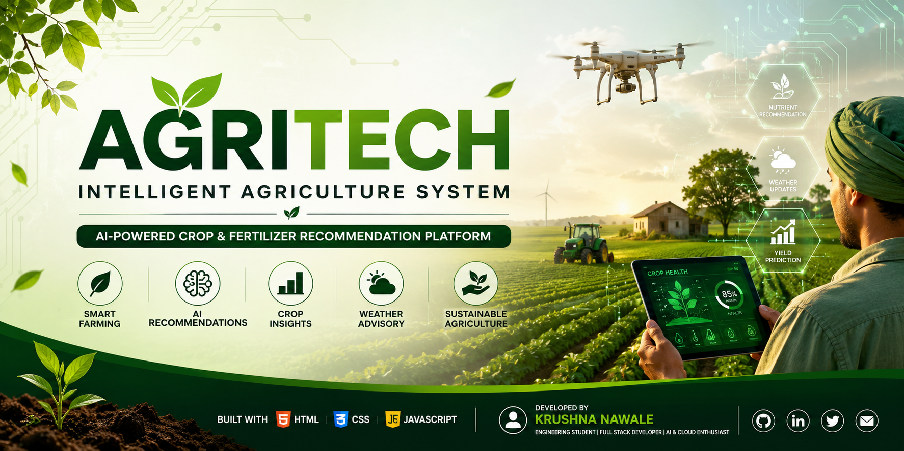

<h1 align="center">
🌾 Agritech – Intelligent Agriculture System
</h1>
<p align="center">
<b>Empowering Smart Farming with AI-Powered Crop & Fertilizer Recommendations</b>

<p align="center">
  
</p>

<br>
An agriculture-focused web platform that helps farmers make better farming decisions using intelligent recommendations, crop information, and modern web technologies.
</p>

<p align="center">


</p>

<p align="center">


</p>

<a href="https://agritech-by-krushna-app.vercel.app/">

</a>
---

# 🌱 About the Project

Agritech is a modern agriculture assistance platform developed to support farmers with intelligent crop management and fertilizer recommendations.

The project combines modern web development with agriculture-focused features to create an easy-to-use interface where users can explore crop information, receive fertilizer suggestions, and learn sustainable farming practices.

This project demonstrates practical implementation of frontend development, JavaScript logic, responsive UI design, and problem-solving for real-world agricultural challenges.

---

# ✨ Features

---

# 🌐 Live Demo

🚀 **Experience Agritech in Action**

<p align="center">

<a href="https://agritech-by-krushna-app.vercel.app/">

</a>

</p>

🔗 **Live Application**

https://agritech-by-krushna-app.vercel.app/

> Explore crop information, AI-powered fertilizer recommendations, agricultural tools, and the responsive user interface directly in your browser. :contentReference[oaicite:0]{index=0}

---

## 🤖 AI-Based Fertilizer Recommendation

Receive fertilizer suggestions based on selected crop type.

---

## 🌾 Crop Information

Learn about various crops including:

- Wheat
- Cotton
- Soybean
- Onion
- Mustard
- Millets
- Pigeon Pea (Toor)

---

## 🌦 Smart Farming

Provides farming guidance based on agricultural best practices.

---

## 📱 Responsive Design

Works smoothly on

- Desktop
- Laptop
- Tablet
- Mobile

---

## 🎨 Modern User Interface

- Clean Layout
- Attractive Design
- Easy Navigation
- Beginner Friendly

---

## 📄 Agricultural Resources

Includes PDF resources and farming guides for better understanding.

---

# 🚀 Why Agritech?

Agriculture remains the backbone of many economies, yet many farmers still rely on traditional decision-making methods.

Agritech aims to bridge this gap by providing:

- Intelligent fertilizer suggestions
- Crop awareness
- Digital farming resources
- Better farming knowledge
- User-friendly interface

---

# 🎯 Project Objectives

✔ Promote Smart Farming

✔ Improve Farming Awareness

✔ Provide Better Fertilizer Guidance

✔ Encourage Sustainable Agriculture

✔ Demonstrate AI Concepts using JavaScript

✔ Build an Industry-Level Frontend Project

---

# 🖥️ Screenshots

> _(Replace these images with your own screenshots.)_

| Home Page                      | About Page                      |
| ------------------------------ | ------------------------------- |
|  |  |

| Fertilizer                           | Contact                           |
| ------------------------------------ | --------------------------------- |
|  |  |

| Tools                           | Crop Information               |
| ------------------------------- | ------------------------------ |
|  |  |

---

# 🛠 Tech Stack

| Category        | Technology   |
| --------------- | ------------ |
| Frontend        | HTML5        |
| Styling         | CSS3         |
| Programming     | JavaScript   |
| Icons           | Font Awesome |
| Version Control | Git          |
| Repository      | GitHub       |

---

# 📂 Project Structure

```text
Agritech
│
├── assets/
│   ├── banner.png
│   ├── logo.png
│   ├── images/
│   ├── crops/
│   ├── fertilizers/
│   └── pdf/
│
├── css/
│   ├── index.css
│   ├── enhanced-styles.css
│   ├── modal-styles.css
│   └── logic.css
│
├── js/
│   ├── index.js
│   └── aiIntegration.js
│
├── pages/
│   ├── about.html
│   ├── contact.html
│   ├── fertilizers.html
│   ├── help.html
│   ├── tool.html
│   └── crop pages...
│
├── docs/
│   ├── screenshots/
│   ├── architecture.png
│   └── demo.gif
│
├── README.md
├── LICENSE
├── CONTRIBUTING.md
├── SECURITY.md
├── ROADMAP.md
└── CITATION.cff
```

---

# 🏗 Project Architecture

```
                User

                  │

                  ▼

        HTML + CSS Frontend

                  │

                  ▼

        JavaScript Logic Layer

                  │

                  ▼

     AI Recommendation Algorithm

                  │

                  ▼

      Crop Recommendation Output

                  │

                  ▼

         Farmer Decision Support
```

---

## 🚀 Quick Start

### Option 1 — Use the Live Website (Recommended)

Visit the deployed application:

🌐 **https://agritech-by-krushna-app.vercel.app/**

No installation required.

---

### Option 2 — Run Locally

```bash
git clone https://github.com/Krushna4142/Agritech.git

cd Agritech
```

Open

```
index.html
```

or run

```bash
python -m http.server 3000
```

Then visit

```
http://localhost:3000
```

## Navigate into Project

```bash
cd Agritech
```

---

## Open Project

Simply open

```
index.html
```

in your browser.

---

## Run Using Python

```bash
python -m http.server 3000
```

Open

```
http://localhost:3000
```

---

## Run Using Node

```bash
npx serve .
```

---

# 🚀 Usage

1. Open the website.

2. Explore available crops.

3. Select a crop.

4. Get fertilizer recommendations.

5. Learn about agricultural tools.

6. Access farming resources.

7. Contact the developer for feedback.

---

# 🌟 Highlights

✅ Responsive UI

✅ AI Recommendation Logic

✅ Easy Navigation

✅ Modern Design

✅ Agriculture Focused

✅ Beginner Friendly

✅ Open Source

---

# 📊 Current Features

| Module                    | Status |
| ------------------------- | ------ |
| Home Page                 | ✅     |
| About                     | ✅     |
| Contact                   | ✅     |
| Crop Information          | ✅     |
| Fertilizer Recommendation | ✅     |
| Agriculture Tools         | ✅     |
| Responsive Design         | ✅     |

---

## ➡️ Continue to **Part 2**

The next section includes:

- 🤖 AI Workflow
- 🛣️ Roadmap
- 🤝 Contributing
- 🛡️ Security Policy
- 📜 License
- 📚 Citation
- 👨‍💻 About the Developer
- 🙏 Acknowledgements
- ⭐ Support the Project
- ❤️ Footer

---

# 🤖 AI Recommendation Workflow

Although Agritech currently uses a rule-based recommendation system, its architecture is designed to support future AI/ML integration.

```text
          User Selects Crop
                  │
                  ▼
       JavaScript Validation
                  │
                  ▼
       Recommendation Engine
                  │
                  ▼
     Match Crop with Fertilizer Data
                  │
                  ▼
      Display Recommendation
```

### Current Recommendation Logic

- 🌾 Crop Selection
- 🧪 Fertilizer Mapping
- 📋 Farming Suggestions
- 💡 User-Friendly Output

### Future AI Enhancements

- 🤖 Machine Learning Models
- ☁️ Weather API Integration
- 🌱 Soil Health Analysis
- 📷 Plant Disease Detection
- 📍 GPS-Based Farming Support
- 📈 Crop Yield Prediction
- 💬 AI Farming Assistant

---

# 📈 Roadmap

## Phase 1 — Completed

- [x] Responsive Website
- [x] Crop Information Pages
- [x] Fertilizer Recommendation
- [x] Agriculture Tools Section
- [x] Contact Page
- [x] Modern UI Design

---

## Phase 2 — In Progress

- [ ] Farmer Dashboard
- [ ] Crop Search
- [ ] Better Recommendation Engine
- [ ] Dark Mode
- [ ] Multi-Language Support

---

## Phase 3 — Future

- [ ] Backend Development
- [ ] Database Integration
- [ ] User Authentication
- [ ] Weather API
- [ ] AI Crop Disease Detection
- [ ] AI Chatbot
- [ ] Mobile Application
- [ ] Cloud Deployment
- [ ] IoT Integration

---

# 💡 Possible Improvements

Contributions are always welcome.

Ideas include:

- Better UI/UX
- New Crop Support
- More Fertilizer Data
- Faster Performance
- Accessibility Improvements
- Better Animations
- API Integration
- Testing
- Documentation

---

# 🤝 Contributing

Contributions help improve Agritech for everyone.

### Steps

1. Fork the repository

2. Clone your fork

```bash
git clone https://github.com/your-username/Agritech.git
```

3. Create a new branch

```bash
git checkout -b feature/NewFeature
```

4. Commit changes

```bash
git commit -m "Add new feature"
```

5. Push changes

```bash
git push origin feature/NewFeature
```

6. Open a Pull Request

Please read **CONTRIBUTING.md** before submitting your contribution.

---

# 📜 Code of Conduct

We are committed to creating a welcoming, respectful, and inclusive environment for everyone.

Please read **CODE_OF_CONDUCT.md** before participating in this project.

---

# 🛡️ Security Policy

If you discover a security vulnerability, please **do not create a public issue**.

Instead, contact:

📧 **krushnanawale4142@gmail.com**

Please read **SECURITY.md** for responsible disclosure guidelines.

---

# 📚 Documentation

Additional project documentation:

- 📄 README.md
- 📄 CONTRIBUTING.md
- 📄 ROADMAP.md
- 📄 CHANGELOG.md
- 📄 SECURITY.md
- 📄 SUPPORT.md

---

# 📝 Changelog

See **CHANGELOG.md** for a complete list of project updates and version history.

---

# 📄 License

This project is licensed under the **MIT License**.

See the **LICENSE** file for more information.

---

# 📖 Citation

If you use this project for research, education, or reference, please cite it.

```bibtex
@software{Agritech2024,
  author = {Krushna Nawale},
  title = {Agritech – Intelligent Agriculture System},
  year = {2024},
  url = {https://github.com/Krushna4142/Agritech}
}
```

GitHub also supports repository citation through the included **CITATION.cff** file.

---

# 🌍 Project Statistics

| Category     | Details                     |
| ------------ | --------------------------- |
| Domain       | Agriculture                 |
| Project Type | Intelligent Web Application |
| Technologies | HTML, CSS, JavaScript       |
| Platform     | Web                         |
| License      | MIT                         |
| Status       | Active Development          |

---

# 👨‍💻 Developer

## Krushna Nawale

Computer Engineering Student

Full Stack Java Developer (Learning)

AI & Cloud Computing Enthusiast

Passionate about building real-world software solutions using modern technologies.

---

### Connect with Me

<p align="left">

<a href="https://github.com/Krushna4142">

</a>

<a href="https://www.linkedin.com/in/krushna4142/">

</a>

<a href="mailto:krushnanawale4142@gmail.com">

</a>

<a href="https://x.com/Krishna_05x">

</a>

</p>

---

# 🙏 Acknowledgements

Special thanks to:

- Open Source Community
- GitHub
- Font Awesome
- Agricultural Learning Resources
- All Contributors and Supporters

---

# ⭐ Support the Project

If you found this project useful:

⭐ Star this repository

🍴 Fork it

🐛 Report issues

💡 Suggest new features

🤝 Contribute to the project

Sharing the repository helps it reach more developers and encourages future improvements.

---

# 📬 Feedback

Have suggestions or ideas?

Feel free to open an issue or contact me directly.

📧 **krushnanawale4142@gmail.com**

I appreciate every piece of feedback.

---

# 🚀 What's Next?

The long-term vision for Agritech is to evolve into a complete smart farming ecosystem by integrating:

- 🌦️ Real-Time Weather Forecasting
- 🌱 Soil Health Analysis
- 🤖 Machine Learning Models
- 📷 AI Disease Detection
- 🛰️ Satellite Data
- 📍 GPS Mapping
- ☁️ Cloud Backend
- 📱 Mobile Application
- 📊 Farmer Dashboard
- 🌍 Multi-Language Support

---

<div align="center">

## 🌾 Agritech

### Empowering Agriculture Through Technology

**Designed & Developed with ❤️ by Krushna Nawale**

⭐ If you like this project, don't forget to **Star** the repository!


</div>
